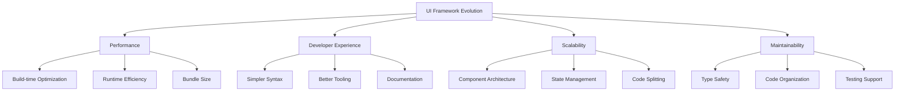

# UI Framework Evolution

## 1. Early Web Development (1990-1995)

### Key Components

- **HTML**: Document structure and hyperlinks
- **CSS**: Visual styling and layout
- **JavaScript**: Client-side functionality
- **Impact**: Foundation for all modern web development

## 2. jQuery Era (2006)

### Key Innovations

- Cross-browser compatibility
- Simplified DOM manipulation
- AJAX request handling
- **Impact**: Made JavaScript development more consistent across browsers

## 3. Modern Framework Revolution

### AngularJS (2010)

#### Key Features

- Two-way data binding
- Modular architecture
- Dependency injection
- **Impact**: Introduced structured approach to web applications

### React (2013)

#### Key Innovations

- Virtual DOM for optimized updates
- Component-based architecture
- Declarative syntax
- **Impact**: Revolutionized UI rendering and state management

### Vue.js (2014)

#### Key Features

- Progressive framework
- Reactive data binding
- Simple template syntax
- **Impact**: Made framework adoption more flexible

## 4. Modern Era Innovations

### Angular 2+ (2016)

- Component-based architecture
- TypeScript integration
- Improved scalability
- **Impact**: Enterprise-grade framework capabilities

### WebAssembly (2017)

- Near-native performance
- Multi-language support
- **Impact**: High-performance web applications

### Svelte (2019)

#### Key Innovations

- Build-time compilation
- Minimal runtime
- Small bundle size
- **Impact**: Performance-focused framework

## 5. Recent Developments (2020-2023)

### Vue 3 (2020)

- Composition API
- Improved performance
- Better TypeScript support

### Solid.js (2020)

- Fine-grained reactivity
- No Virtual DOM
- High performance

### Svelte 4 (2023)

- Runes system
- Improved performance
- Better JavaScript ecosystem integration

## 6. Future Directions

### Performance Optimization

- Build-time compilation
- Minimal runtime overhead
- Efficient state management

### Developer Experience

- Simplified syntax
- Better tooling
- Improved debugging

### Scalability

- Micro-frontend architecture
- Better state management
- Improved code organization

### Maintainability

- Type safety
- Better testing capabilities
- Improved documentation

## 7. Research Methodology

### Primary Sources

- Framework documentation
- GitHub repositories
- Official blogs

### Secondary Sources

- Stack Overflow surveys
- Developer blogs
- Technical articles

### Data Collection

- Usage statistics
- Performance metrics
- Developer satisfaction surveys

