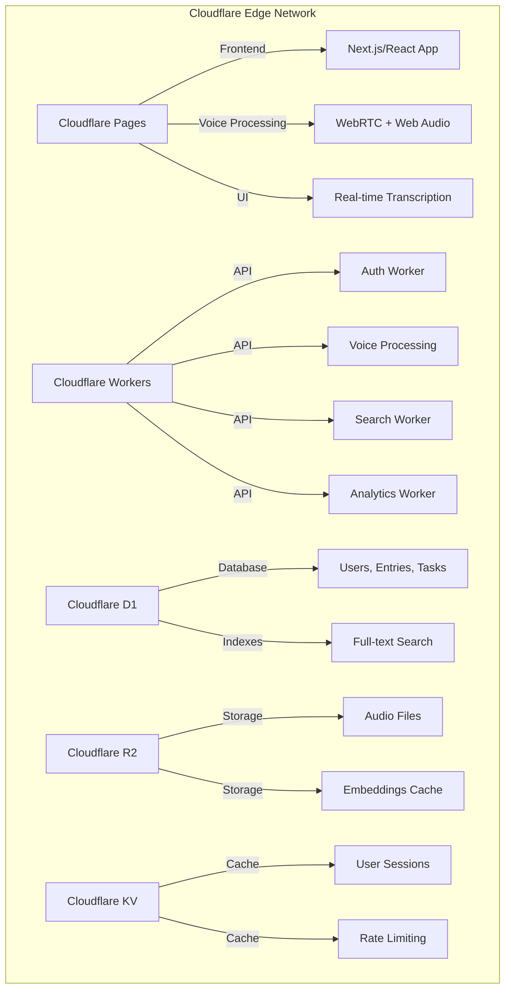

# 🧠 Brain AI: Cloudflare-Native Technical Architecture

## 1. Complete Cloudflare Stack Architecture



## 2. Cloudflare D1 Database Schema

### Users
```sql
CREATE TABLE users (
  id TEXT PRIMARY KEY,
  email TEXT UNIQUE NOT NULL,
  created_at DATETIME DEFAULT CURRENT_TIMESTAMP,
  subscription_tier TEXT DEFAULT 'free',
  settings TEXT DEFAULT '{}', -- JSON string
  stripe_customer_id TEXT,
  usage_count INTEGER DEFAULT 0,
  last_active DATETIME DEFAULT CURRENT_TIMESTAMP
);
```

### Voice Entries
```sql
CREATE TABLE voice_entries (
  id TEXT PRIMARY KEY,
  user_id TEXT NOT NULL,
  audio_url TEXT, -- R2 storage URL
  transcript TEXT NOT NULL,
  processed_content TEXT DEFAULT '{}', -- JSON
  embedding TEXT, -- Stored as base64 or JSON array
  metadata TEXT DEFAULT '{}', -- JSON: emotion, confidence, duration
  entry_type TEXT DEFAULT 'note', -- task, idea, reflection, goal
  status TEXT DEFAULT 'active',
  created_at DATETIME DEFAULT CURRENT_TIMESTAMP,
  updated_at DATETIME DEFAULT CURRENT_TIMESTAMP,
  FOREIGN KEY (user_id) REFERENCES users(id) ON DELETE CASCADE
);
```

### Tasks
```sql
CREATE TABLE tasks (
  id TEXT PRIMARY KEY,
  user_id TEXT NOT NULL,
  voice_entry_id TEXT,
  title TEXT NOT NULL,
  description TEXT,
  due_date DATETIME,
  status TEXT DEFAULT 'pending',
  priority INTEGER DEFAULT 1,
  completed_at DATETIME,
  created_at DATETIME DEFAULT CURRENT_TIMESTAMP,
  FOREIGN KEY (user_id) REFERENCES users(id) ON DELETE CASCADE,
  FOREIGN KEY (voice_entry_id) REFERENCES voice_entries(id) ON DELETE CASCADE
);
```

### Tags System
```sql
-- Tags table
CREATE TABLE tags (
  id TEXT PRIMARY KEY,
  user_id TEXT NOT NULL,
  name TEXT NOT NULL,
  color TEXT DEFAULT '#3B82F6',
  created_at DATETIME DEFAULT CURRENT_TIMESTAMP,
  FOREIGN KEY (user_id) REFERENCES users(id) ON DELETE CASCADE
);

-- Entry-tag relationships
CREATE TABLE entry_tags (
  entry_id TEXT,
  tag_id TEXT,
  PRIMARY KEY (entry_id, tag_id),
  FOREIGN KEY (entry_id) REFERENCES voice_entries(id) ON DELETE CASCADE,
  FOREIGN KEY (tag_id) REFERENCES tags(id) ON DELETE CASCADE
);
```

### Sessions & Analytics
```sql
-- User sessions
CREATE TABLE sessions (
  session_id TEXT PRIMARY KEY,
  user_id TEXT NOT NULL,
  expires_at DATETIME NOT NULL,
  created_at DATETIME DEFAULT CURRENT_TIMESTAMP,
  FOREIGN KEY (user_id) REFERENCES users(id) ON DELETE CASCADE
);

-- Analytics patterns
CREATE TABLE analytics_patterns (
  id TEXT PRIMARY KEY,
  user_id TEXT NOT NULL,
  pattern_type TEXT, -- topic, emotion, productivity
  pattern_data TEXT, -- JSON
  date_range_start DATETIME,
  date_range_end DATETIME,
  created_at DATETIME DEFAULT CURRENT_TIMESTAMP,
  FOREIGN KEY (user_id) REFERENCES users(id) ON DELETE CASCADE
);

-- Indexes
CREATE INDEX idx_entries_transcript_fts ON voice_entries(transcript);
CREATE INDEX idx_entries_user_created ON voice_entries(user_id, created_at DESC);
CREATE INDEX idx_tasks_user_status ON tasks(user_id, status);
CREATE INDEX idx_tags_user_name ON tags(user_id, name);
```

## 3. Cloudflare Workers API Architecture

### Main API Worker (`api.brain.ai.workers.dev`)

```typescript
// src/index.ts - Main Worker Entry Point
import { Hono } from 'hono';
import { cors } from 'hono/cors';
import { logger } from 'hono/logger';

import authRoutes from './routes/auth';
import voiceRoutes from './routes/voice';
import entriesRoutes from './routes/entries';
import searchRoutes from './routes/search';

const app = new Hono<{ Bindings: Env }>();

// Middleware
app.use('*', cors());
app.use('*', logger());

// Routes
app.route('/auth', authRoutes);
app.route('/voice', voiceRoutes);
app.route('/entries', entriesRoutes);
app.route('/search', searchRoutes);

// Health check endpoint
app.get('/health', (c) => 
  c.json({ 
    status: 'ok', 
    timestamp: Date.now() 
  })
);

export default app;
```

### Environment Configuration

```toml
# wrangler.toml
name = "brain-ai-api"
main = "src/index.ts"
compatibility_date = "2024-01-01"

[env.production.vars]
OPENAI_API_KEY = ""
DEEPGRAM_API_KEY = ""
ELEVENLABS_API_KEY = ""
STRIPE_SECRET_KEY = ""
JWT_SECRET = ""
R2_BUCKET_NAME = "brain-ai-audio"
D1_DATABASE = "brain-ai-db"
KV_NAMESPACE = "brain-ai-sessions"
```

### Specialized Workers

#### Voice Processing Worker
```typescript
// voice-processor-worker.ts
export default {
  async fetch(request: Request, env: Env, ctx: ExecutionContext) {
    // Handle audio upload → transcription → intent parsing
    // Stream processing for real-time feel
    if (request.method === 'POST') {
      const formData = await request.formData();
      const audioFile = formData.get('audio') as File;
      
      // Process audio and return transcription
      return new Response(JSON.stringify({
        text: 'Transcribed text here',
        intent: 'note',
        entities: []
      }), {
        headers: { 'Content-Type': 'application/json' }
      });
    }
    
    return new Response('Method not allowed', { status: 405 });
  }
};
```

#### Search Worker
```typescript
// search-worker.ts
export default {
  async fetch(request: Request, env: Env) {
    const { query, userId } = await request.json();
    
    // Perform vector + hybrid search
    const results = await searchEntries(query, userId, env);
    
    return new Response(JSON.stringify(results), {
      headers: { 'Content-Type': 'application/json' }
    });
  }
};
```

### API Routes Implementation

#### Voice Routes
```typescript
// src/routes/voice.ts
import { Hono } from 'hono';
import { authMiddleware } from '../middleware/auth';

const voice = new Hono<{ Bindings: Env }>();

// Upload and process audio
voice.post('/transcribe', authMiddleware, async (c) => {
  try {
    const formData = await c.req.formData();
    const audioFile = formData.get('audio') as File;
    const userId = c.get('userId');

    // 1. Store in R2
    const audioId = crypto.randomUUID();
    await env.R2_BUCKET.put(`audio/${audioId}.webm`, audioFile);

    // 2. Transcribe with Deepgram (simplified)
    const transcription = await transcribeAudio(audioFile, env);

    // 3. Store in D1
    await env.DB.prepare(`
      INSERT INTO voice_entries (id, user_id, transcript, audio_url)
      VALUES (?, ?, ?, ?)
    `).bind(
      audioId, 
      userId, 
      transcription.text, 
      `audio/${audioId}.webm`
    ).run();

    return c.json({ 
      id: audioId, 
      transcript: transcription.text 
    });
    
  } catch (error) {
    console.error('Transcription error:', error);
    return c.json({ error: 'Failed to process audio' }, 500);
  }
});

// Real-time transcription via WebSocket
voice.get('/stream', async (c) => {
  const upgradeHeader = c.req.header('Upgrade');
  if (upgradeHeader !== 'websocket') {
    return c.text('Expected WebSocket request', 400);
  }
  
  return handleWebSocketStream(c);
});

export default voice;
```

Would you like me to continue with the remaining sections of the document?ebSocket Handler for Real-time Transcription

// src/websocket/transcription.ts
export async function handleWebSocketStream(c) {
const pair = new WebSocketPair()
const [client, server] = pair.ports

    server.accept()

    // Connect to Deepgram WebSocket
    const deepgramWs = new WebSocket('wss://api.deepgram.com/v1/listen', {
      headers: { 'Authorization': `Token ${env.DEEPGRAM_API_KEY}` }
    })

    // Forward audio from client to Deepgram
    server.addEventListener('message', (event) => {
      deepgramWs.send(event.data)
    })

    // Forward transcription from Deepgram to client
    deepgramWs.addEventListener('message', (event) => {
      const result = JSON.parse(event.data)
      if (result.channel?.alternatives?.[0]?.transcript) {
        server.send(JSON.stringify({
          type: 'transcript',
          text: result.channel.alternatives[0].transcript,
          is_final: result.is_final
        }))
      }
    })

    return new Response(null, {
      status: 101,
      webSocket: client
    })

}

⏺ 4. Cloudflare Pages Frontend Architecture

Project Structure

brain-ai-frontend/
├── wrangler.toml
├── package.json
├── next.config.js
├── src/
│ ├── app/
│ │ ├── (dashboard)/
│ │ │ ├── layout.tsx
│ │ │ ├── page.tsx # Main voice interface
│ │ │ ├── timeline/
│ │ │ ├── search/
│ │ │ └── insights/
│ │ ├── api/ # API routes for server-side functions
│ │ ├── auth/
│ │ └── globals.css
│ ├── components/
│ │ ├── voice/
│ │ │ ├── VoiceRecorder.tsx
│ │ │ ├── AudioWaveform.tsx
│ │ │ ├── TranscriptionDisplay.tsx
│ │ │ └── VoicePlayer.tsx
│ │ ├── entries/
│ │ ├── search/
│ │ └── insights/
│ ├── lib/
│ │ ├── cloudflare.ts
│ │ ├── audio.ts
│ │ └── websocket.ts
│ └── hooks/
│ ├── useVoiceRecorder.ts
│ ├── useWebSocket.ts
│ └── useAuth.ts
└── functions/
└── api/
└── auth/ # Edge functions for auth

Cloudflare Pages Configuration

# wrangler.toml

name = "brain-ai"
compatibility_date = "2024-01-01"
pages_build_output_dir = ".vercel/output"

[env.production.vars]
VITE_API_URL = "https://api.brain.ai.workers.dev"
VITE_WS_URL = "wss://api.brain.ai.workers.dev"

Voice Recording Component (Cloudflare Optimized)

// src/components/voice/VoiceRecorder.tsx
import { useState, useRef, useCallback } from 'react'
import { useWebSocket } from '@/hooks/useWebSocket'

interface VoiceRecorderProps {
onTranscript: (text: string) => void
onProcessingComplete: (result: ProcessingResult) => void
}

export default function VoiceRecorder({ onTranscript, onProcessingComplete }:
VoiceRecorderProps) {
const [isRecording, setIsRecording] = useState(false)
const [audioLevel, setAudioLevel] = useState(0)
const mediaRecorderRef = useRef<MediaRecorder>()
const audioContextRef = useRef<AudioContext>()
const analyserRef = useRef<AnalyserNode>()

    const { connect, send, disconnect, lastMessage } = useWebSocket({
      url: process.env.NEXT_PUBLIC_WS_URL + '/voice/stream',
      onMessage: (data) => {
        if (data.type === 'transcript') {
          onTranscript(data.text)
          if (data.is_final) {
            // Trigger final processing
            processFinalTranscript(data.text)
          }
        }
      }
    })

    const startRecording = useCallback(async () => {
      try {
        const stream = await navigator.mediaDevices.getUserMedia({
          audio: {
            echoCancellation: true,
            noiseSuppression: true,
            sampleRate: 16000
          }
        })

        // Setup audio context for visualization
        audioContextRef.current = new AudioContext()
        analyserRef.current = audioContextRef.current.createAnalyser()
        const source = audioContextRef.current.createMediaStreamSource(stream)
        source.connect(analyserRef.current)

        // Setup MediaRecorder for chunked upload
        const mediaRecorder = new MediaRecorder(stream, {
          mimeType: 'audio/webm;codecs=opus'
        })

        mediaRecorderRef.current = mediaRecorder

        // Send chunks to WebSocket as they're recorded
        mediaRecorder.ondataavailable = async (event) => {
          if (event.data.size > 0 && connect) {
            await send(event.data)
          }
        }

        // Start recording in 100ms chunks
        mediaRecorder.start(100)
        setIsRecording(true)

        // Visualize audio levels
        visualizeAudio()

      } catch (error) {
        console.error('Error starting recording:', error)
      }
    }, [connect, send])

    const stopRecording = useCallback(() => {
      if (mediaRecorderRef.current && isRecording) {
        mediaRecorderRef.current.stop()
        mediaRecorderRef.current.stream.getTracks().forEach(track => track.stop())
        setIsRecording(false)

        if (audioContextRef.current) {
          audioContextRef.current.close()
        }

        disconnect()
      }
    }, [isRecording, disconnect])

    const visualizeAudio = () => {
      if (!analyserRef.current) return

      const dataArray = new Uint8Array(analyserRef.current.frequencyBinCount)

      const animate = () => {
        if (!isRecording) return

        analyserRef.current!.getByteFrequencyData(dataArray)
        const average = dataArray.reduce((a, b) => a + b) / dataArray.length
        setAudioLevel(average / 255)

        requestAnimationFrame(animate)
      }

      animate()
    }

    const processFinalTranscript = async (transcript: string) => {
      try {
        const response = await fetch('/api/voice/process', {
          method: 'POST',
          headers: { 'Content-Type': 'application/json' },
          body: JSON.stringify({ transcript })
        })

        const result = await response.json()
        onProcessingComplete(result)
      } catch (error) {
        console.error('Error processing transcript:', error)
      }
    }

    return (
      <div className="voice-recorder">
        <button
          onClick={isRecording ? stopRecording : startRecording}
          className={`record-button ${isRecording ? 'recording' : ''}`}
        >
          <div className="audio-level" style={{ transform: `scale(${1 + audioLevel})` }} />
          {isRecording ? 'Stop' : 'Start Talking'}
        </button>
      </div>
    )

}

WebSocket Hook for Cloudflare Workers

// src/hooks/useWebSocket.ts
import { useState, useEffect, useRef, useCallback } from 'react'

interface UseWebSocketOptions {
url: string
onMessage?: (data: any) => void
onError?: (error: Event) => void
}

export function useWebSocket({ url, onMessage, onError }: UseWebSocketOptions) {
const [isConnected, setIsConnected] = useState(false)
const [lastMessage, setLastMessage] = useState<any>(null)
const wsRef = useRef<WebSocket>()
const reconnectTimeoutRef = useRef<NodeJS.Timeout>()

    const connect = useCallback(() => {
      try {
        const ws = new WebSocket(url)
        wsRef.current = ws

        ws.onopen = () => {
          setIsConnected(true)
          console.log('WebSocket connected')
        }

        ws.onmessage = (event) => {
          const data = JSON.parse(event.data)
          setLastMessage(data)
          onMessage?.(data)
        }

        ws.onclose = () => {
          setIsConnected(false)
          // Auto-reconnect after 3 seconds
          reconnectTimeoutRef.current = setTimeout(connect, 3000)
        }

        ws.onerror = (error) => {
          console.error('WebSocket error:', error)
          onError?.(error)
        }

      } catch (error) {
        console.error('Failed to connect WebSocket:', error)
      }
    }, [url, onMessage, onError])

    const disconnect = useCallback(() => {
      if (reconnectTimeoutRef.current) {
        clearTimeout(reconnectTimeoutRef.current)
      }
      if (wsRef.current) {
        wsRef.current.close()
      }
    }, [])

    const send = useCallback(async (data: Blob | string) => {
      if (wsRef.current?.readyState === WebSocket.OPEN) {
        if (data instanceof Blob) {
          wsRef.current.send(data)
        } else {
          wsRef.current.send(JSON.stringify(data))
        }
      }
    }, [])

    useEffect(() => {
      return () => disconnect()
    }, [disconnect])

    return { connect, disconnect, send, isConnected, lastMessage }

}

⏺ 5. Authentication with Cloudflare Workers

JWT-based Auth System

// src/lib/auth.ts
import { sign, verify } from 'hono/jwt'
import type { JWTPayload } from 'hono/jwt'

interface User {
id: string
email: string
subscription_tier: string
}

export class AuthService {
private jwtSecret: string
private kv: KVNamespace

    constructor(jwtSecret: string, kv: KVNamespace) {
      this.jwtSecret = jwtSecret
      this.kv = kv
    }

    async generateToken(user: User): Promise<string> {
      const payload = {
        sub: user.id,
        email: user.email,
        tier: user.subscription_tier,
        exp: Math.floor(Date.now() / 1000) + (24 * 60 * 60) // 24 hours
      }

      return await sign(payload, this.jwtSecret)
    }

    async verifyToken(token: string): Promise<JWTPayload | null> {
      try {
        return await verify(token, this.jwtSecret)
      } catch (error) {
        return null
      }
    }

    async createSession(userId: string): Promise<string> {
      const sessionId = crypto.randomUUID()
      const expiresAt = new Date(Date.now() + 24 * 60 * 60 * 1000) // 24 hours

      await this.kv.put(`session:${sessionId}`, JSON.stringify({
        userId,
        createdAt: Date.now(),
        expiresAt: expiresAt.toISOString()
      }), { expirationTtl: 24 * 60 * 60 })

      return sessionId
    }

    async validateSession(sessionId: string): Promise<string | null> {
      const sessionData = await this.kv.get(`session:${sessionId}`)
      if (!sessionData) return null

      const session = JSON.parse(sessionData)
      return session.userId
    }

}

// Auth Middleware
export const authMiddleware = async (c: Context, next: Next) => {
const authHeader = c.req.header('Authorization')
const sessionId = c.req.header('X-Session-ID')

    let userId: string | null = null

    // Try JWT auth first
    if (authHeader?.startsWith('Bearer ')) {
      const token = authHeader.substring(7)
      const payload = await c.env.AUTH_SERVICE.verifyToken(token)
      userId = payload?.sub || null
    }

    // Fallback to session ID
    if (!userId && sessionId) {
      userId = await c.env.AUTH_SERVICE.validateSession(sessionId)
    }

    if (!userId) {
      return c.json({ error: 'Unauthorized' }, 401)
    }

    c.set('userId', userId)
    await next()

}

Auth Routes

// src/routes/auth.ts
import { Hono } from 'hono'
import { cors } from 'hono/cors'

const auth = new Hono<{ Bindings: Env }>()

// Magic link authentication
auth.post('/magic-link', async (c) => {
const { email } = await c.req.json()

    // Generate magic link token
    const token = crypto.randomUUID()
    await c.env.KV.put(`magic_link:${token}`, JSON.stringify({
      email,
      createdAt: Date.now()
    }), { expirationTtl: 15 * 60 }) // 15 minutes expiry

    // Send magic link email (using Mailgun or Resend)
    const magicLink = `${c.env.APP_URL}/auth/verify?token=${token}`
    await sendMagicLinkEmail(email, magicLink)

    return c.json({ message: 'Magic link sent' })

})

// Verify magic link
auth.post('/verify', async (c) => {
const { token } = await c.req.json()

    const linkData = await c.env.KV.get(`magic_link:${token}`)
    if (!linkData) {
      return c.json({ error: 'Invalid or expired token' }, 400)
    }

    const { email } = JSON.parse(linkData)

    // Get or create user
    let user = await c.env.DB.prepare(
      'SELECT * FROM users WHERE email = ?'
    ).bind(email).first()

    if (!user) {
      const userId = crypto.randomUUID()
      await c.env.DB.prepare(`
        INSERT INTO users (id, email, created_at)
        VALUES (?, ?, ?)
      `).bind(userId, email, new Date().toISOString()).run()

      user = { id: userId, email, subscription_tier: 'free' }
    }

    // Generate session
    const sessionId = await c.env.AUTH_SERVICE.createSession(user.id)
    const jwtToken = await c.env.AUTH_SERVICE.generateToken(user)

    // Clean up magic link
    await c.env.KV.delete(`magic_link:${token}`)

    return c.json({
      user: { id: user.id, email: user.email, tier: user.subscription_tier },
      sessionId,
      token: jwtToken
    })

})

// Refresh token
auth.post('/refresh', async (c) => {
const { sessionId } = await c.req.json()

    const userId = await c.env.AUTH_SERVICE.validateSession(sessionId)
    if (!userId) {
      return c.json({ error: 'Invalid session' }, 401)
    }

    const user = await c.env.DB.prepare(
      'SELECT * FROM users WHERE id = ?'
    ).bind(userId).first()

    const newToken = await c.env.AUTH_SERVICE.generateToken(user)

    return c.json({ token: newToken })

})

export default auth

Frontend Auth Hook

// src/hooks/useAuth.ts
import { useState, useEffect } from 'react'

interface User {
id: string
email: string
tier: string
}

export function useAuth() {
const [user, setUser] = useState<User | null>(null)
const [loading, setLoading] = useState(true)

    useEffect(() => {
      // Check for existing session
      const sessionId = localStorage.getItem('brain_session_id')
      const token = localStorage.getItem('brain_token')

      if (sessionId && token) {
        validateSession(sessionId, token)
      } else {
        setLoading(false)
      }
    }, [])

    const validateSession = async (sessionId: string, token: string) => {
      try {
        const response = await fetch('/api/auth/validate', {
          headers: {
            'Authorization': `Bearer ${token}`,
            'X-Session-ID': sessionId
          }
        })

        if (response.ok) {
          const { user } = await response.json()
          setUser(user)
        } else {
          localStorage.removeItem('brain_session_id')
          localStorage.removeItem('brain_token')
        }
      } catch (error) {
        console.error('Session validation failed:', error)
      }

      setLoading(false)
    }

    const signIn = async (email: string) => {
      try {
        const response = await fetch('/api/auth/magic-link', {
          method: 'POST',
          headers: { 'Content-Type': 'application/json' },
          body: JSON.stringify({ email })
        })

        if (response.ok) {
          return { success: true }
        }
      } catch (error) {
        console.error('Sign in error:', error)
      }

      return { success: false }
    }

    const signOut = () => {
      localStorage.removeItem('brain_session_id')
      localStorage.removeItem('brain_token')
      setUser(null)
    }

    return { user, loading, signIn, signOut }

}

⏺ 6. Voice Processing Pipeline with Cloudflare

Real-time Voice Processing Flow

// src/voice-processing/pipeline.ts
export class VoiceProcessingPipeline {
private deepgramApiKey: string
private openaiApiKey: string
private elevenLabsApiKey: string
private r2Bucket: R2Bucket

    constructor(env: Env) {
      this.deepgramApiKey = env.DEEPGRAM_API_KEY
      this.openaiApiKey = env.OPENAI_API_KEY
      this.elevenLabsApiKey = env.ELEVENLABS_API_KEY
      this.r2Bucket = env.R2_BUCKET
    }

    async processAudioStream(audioStream: ReadableStream, userId: string):

Promise<ProcessingResult> {
// Step 1: Convert stream to buffer and store in R2
const audioBuffer = await this.streamToBuffer(audioStream)
const audioId = crypto.randomUUID()

      await this.r2Bucket.put(`audio/${audioId}.webm`, audioBuffer, {
        httpMetadata: { contentType: 'audio/webm' }
      })

      // Step 2: Transcribe with Deepgram
      const transcription = await this.transcribeAudio(audioBuffer)

      // Step 3: Parse intent with OpenAI
      const intent = await this.parseIntent(transcription.text)

      // Step 4: Generate embedding for search
      const embedding = await this.generateEmbedding(transcription.text)

      // Step 5: Extract tasks if any
      const tasks = await this.extractTasks(transcription.text, intent)

      // Step 6: Generate voice response
      const responseAudio = await this.generateVoiceResponse(intent)

      return {
        audioId,
        transcript: transcription.text,
        intent,
        embedding,
        tasks,
        responseAudioUrl: responseAudio?.url,
        confidence: transcription.confidence
      }
    }

    private async transcribeAudio(audioBuffer: ArrayBuffer): Promise<TranscriptionResult> {
      const response = await

fetch('https://api.deepgram.com/v1/listen?model=nova-2&language=en&smart_format=true', {
method: 'POST',
headers: {
'Authorization': `Token ${this.deepgramApiKey}`,
'Content-Type': 'audio/webm'
},
body: audioBuffer
})

      const result = await response.json()
      return {
        text: result.results?.channels?.[0]?.alternatives?.[0]?.transcript || '',
        confidence: result.results?.channels?.[0]?.alternatives?.[0]?.confidence || 0
      }
    }

    private async parseIntent(transcript: string): Promise<IntentResult> {
      const prompt = `

Analyze this voice transcript and extract structured information:

Transcript: "${transcript}"

Return a JSON object with:
{
"type": "task|idea|reflection|goal|note|question",
"entities": ["person", "project", "date", "time"],
"emotion": "excited|neutral|stressed|confident|curious",
"priority": "high|medium|low",
"tags": ["relevant", "keywords"],
"action_items": ["if any tasks mentioned"],
"context": "brief context summary"
}
`

      const response = await fetch('https://api.openai.com/v1/chat/completions', {
        method: 'POST',
        headers: {
          'Authorization': `Bearer ${this.openaiApiKey}`,
          'Content-Type': 'application/json'
        },
        body: JSON.stringify({
          model: 'gpt-4-turbo-preview',
          messages: [{ role: 'user', content: prompt }],
          temperature: 0.3
        })
      })

      const result = await response.json()
      return JSON.parse(result.choices[0].message.content)
    }

    private async generateEmbedding(text: string): Promise<number[]> {
      const response = await fetch('https://api.openai.com/v1/embeddings', {
        method: 'POST',
        headers: {
          'Authorization': `Bearer ${this.openaiApiKey}`,
          'Content-Type': 'application/json'
        },
        body: JSON.stringify({
          model: 'text-embedding-3-small',
          input: text
        })
      })

      const result = await response.json()
      return result.data[0].embedding
    }

    private async extractTasks(transcript: string, intent: IntentResult): Promise<TaskData[]> {
      if (intent.type !== 'task' && intent.action_items.length === 0) {
        return []
      }

      const tasks: TaskData[] = []

      for (const actionItem of intent.action_items) {
        const taskPrompt = `

Convert this action item into a structured task:
"${actionItem}"

Extract:

- Title (short, actionable)
- Due date (if mentioned)
- Priority level
- Any dependencies

Return as JSON: {title, dueDate, priority, description}
`

        const response = await fetch('https://api.openai.com/v1/chat/completions', {
          method: 'POST',
          headers: {
            'Authorization': `Bearer ${this.openaiApiKey}`,
            'Content-Type': 'application/json'
          },
          body: JSON.stringify({
            model: 'gpt-3.5-turbo',
            messages: [{ role: 'user', content: taskPrompt }],
            temperature: 0.1
          })
        })

        const result = await response.json()
        const taskData = JSON.parse(result.choices[0].message.content)
        tasks.push({
          id: crypto.randomUUID(),
          ...taskData,
          status: 'pending'
        })
      }

      return tasks
    }

    private async generateVoiceResponse(intent: IntentResult): Promise<{url: string} | null> {
      let responseText = ''

      switch (intent.type) {
        case 'task':
          responseText = `Got it. I've added ${intent.action_items.length}

task${intent.action_items.length > 1 ? 's' : ''} to your list.`
break
case 'idea':
responseText = 'Great idea! I\'ve saved that to your thoughts.'
break
case 'reflection':
responseText = 'Thanks for sharing. I\'ve noted that reflection.'
break
case 'goal':
responseText = 'Goal noted! I\'ll help you stay on track with this.'
break
default:
responseText = 'Got it. I\'ve saved that for you.'
}

      try {
        const response = await

fetch(`https://api.elevenlabs.io/v1/text-to-speech/${process.env.ELEVENLABS_VOICE_ID}`, {
method: 'POST',
headers: {
'Accept': 'audio/mpeg',
'xi-api-key': this.elevenLabsApiKey,
'Content-Type': 'application/json'
},
body: JSON.stringify({
text: responseText,
voice_settings: {
stability: 0.75,
similarity_boost: 0.75
}
})
})

        const audioBuffer = await response.arrayBuffer()
        const audioId = crypto.randomUUID()

        await this.r2Bucket.put(`responses/${audioId}.mp3`, audioBuffer, {
          httpMetadata: { contentType: 'audio/mpeg' }
        })

        return { url: `responses/${audioId}.mp3` }
      } catch (error) {
        console.error('Voice response generation failed:', error)
        return null
      }
    }

}

// Types
interface ProcessingResult {
audioId: string
transcript: string
intent: IntentResult
embedding: number[]
tasks: TaskData[]
responseAudioUrl?: string
confidence: number
}

interface IntentResult {
type: string
entities: string[]
emotion: string
priority: string
tags: string[]
action_items: string[]
context: string
}

interface TaskData {
id: string
title: string
dueDate?: string
priority: string
description?: string
status: string
}

Real-time WebSocket Implementation

// src/websocket/voice-handler.ts
export class VoiceWebSocketHandler {
private pipeline: VoiceProcessingPipeline
private sessions: Map<string, WebSocketSession> = new Map()

    constructor(env: Env) {
      this.pipeline = new VoiceProcessingPipeline(env)
    }

    async handleWebSocket(request: Request, env: Env): Promise<Response> {
      const upgradeHeader = request.headers.get('Upgrade')
      if (upgradeHeader !== 'websocket') {
        return new Response('Expected websocket', { status: 400 })
      }

      const [client, server] = Object.values(new WebSocketPair())
      server.accept()

      const sessionId = crypto.randomUUID()
      const session: WebSocketSession = {
        id: sessionId,
        ws: server,
        audioBuffer: new ArrayBuffer(0),
        startTime: Date.now()
      }

      this.sessions.set(sessionId, session)

      server.addEventListener('message', async (event) => {
        try {
          if (event.data instanceof ArrayBuffer) {
            // Accumulate audio data
            session.audioBuffer = this.concatArrayBuffers(session.audioBuffer, event.data)

            // Send to Deepgram for real-time transcription
            const transcription = await this.streamToDeepgram(event.data)

            if (transcription) {
              server.send(JSON.stringify({
                type: 'transcript',
                text: transcription.text,
                is_final: transcription.is_final,
                confidence: transcription.confidence
              }))
            }
          } else if (typeof event.data === 'string') {
            const message = JSON.parse(event.data)

            switch (message.type) {
              case 'start_recording':
                server.send(JSON.stringify({ type: 'recording_started' }))
                break

              case 'stop_recording':
                await this.finalizeRecording(sessionId)
                break

              case 'ping':
                server.send(JSON.stringify({ type: 'pong' }))
                break
            }
          }
        } catch (error) {
          console.error('WebSocket message error:', error)
          server.send(JSON.stringify({
            type: 'error',
            message: 'Processing failed'
          }))
        }
      })

      server.addEventListener('close', () => {
        this.sessions.delete(sessionId)
      })

      return new Response(null, {
        status: 101,
        webSocket: client
      })
    }

    private async streamToDeepgram(audioChunk: ArrayBuffer): Promise<TranscriptChunk | null> {
      // Stream audio chunk to Deepgram for real-time processing
      try {
        const response = await

fetch('https://api.deepgram.com/v1/listen?encoding=opus&sample_rate=16000', {
method: 'POST',
headers: {
'Authorization': `Token ${process.env.DEEPGRAM_API_KEY}',
'Content-Type': 'application/octet-stream'
},
body: audioChunk
})

        const result = await response.json()

        if (result.results?.channels?.[0]?.alternatives?.[0]) {
          return {
            text: result.results.channels[0].alternatives[0].transcript,
            is_final: result.is_final || false,
            confidence: result.results.channels[0].alternatives[0].confidence
          }
        }
      } catch (error) {
        console.error('Deepgram streaming error:', error)
      }

      return null
    }

    private async finalizeRecording(sessionId: string) {
      const session = this.sessions.get(sessionId)
      if (!session) return

      try {
        // Process the complete audio
        const userId = 'temp-user-id' // Extract from auth
        const result = await this.pipeline.processAudioStream(
          new ReadableStream({
            start(controller) {
              controller.enqueue(session.audioBuffer)
              controller.close()
            }
          }),
          userId
        )

        // Send final result back to client
        session.ws.send(JSON.stringify({
          type: 'processing_complete',
          result
        }))

        // Clean up session
        this.sessions.delete(sessionId)

      } catch (error) {
        console.error('Finalization error:', error)
        session.ws.send(JSON.stringify({
          type: 'error',
          message: 'Failed to process recording'
        }))
      }
    }

    private concatArrayBuffers(buffer1: ArrayBuffer, buffer2: ArrayBuffer): ArrayBuffer {
      const tmp = new Uint8Array(buffer1.byteLength + buffer2.byteLength)
      tmp.set(new Uint8Array(buffer1), 0)
      tmp.set(new Uint8Array(buffer2), buffer1.byteLength)
      return tmp.buffer
    }

}

interface WebSocketSession {
id: string
ws: WebSocket
audioBuffer: ArrayBuffer
startTime: number
}

interface TranscriptChunk {
text: string
is_final: boolean
confidence: number
}

⏺ 7. Cloudflare Deployment Roadmap

Deployment Configuration

# wrangler.toml for API Worker

name = "brain-ai-api"
main = "src/index.ts"
compatibility_date = "2024-01-01"

[env.production]
vars = { ENVIRONMENT = "production" }

[env.staging]
vars = { ENVIRONMENT = "staging" }

# D1 Database binding

[[env.production.d1_databases]]
binding = "DB"
database_name = "brain-ai-prod"
database_id = "your-database-id"

# KV Namespace binding

[[env.production.kv_namespaces]]
binding = "SESSIONS"
id = "your-kv-namespace-id"

# R2 Bucket binding

[[env.production.r2_buckets]]
binding = "R2_BUCKET"
bucket_name = "brain-ai-storage"

# Durable Objects for WebSocket connections

[[env.production.durable_objects.bindings]]
name = "WEBSOCKET_MANAGER"
class_name = "WebSocketManager"

CI/CD Pipeline with GitHub Actions

# .github/workflows/deploy.yml

name: Deploy Brain AI

on:
push:
branches: [main]
pull_request:
branches: [main]

jobs:
test:
runs-on: ubuntu-latest
steps: - uses: actions/checkout@v4 - uses: actions/setup-node@v4
with:
node-version: '20'

        - name: Install dependencies
          run: npm ci

        - name: Run tests
          run: npm test

        - name: Type check
          run: npm run type-check

    deploy-api:
      needs: test
      runs-on: ubuntu-latest
      if: github.ref == 'refs/heads/main'

      steps:
        - uses: actions/checkout@v4

        - name: Deploy to Cloudflare Workers
          uses: cloudflare/wrangler-action@v3
          with:
            apiToken: ${{ secrets.CLOUDFLARE_API_TOKEN }}
            command: deploy --env production

    deploy-frontend:
      needs: test
      runs-on: ubuntu-latest
      if: github.ref == 'refs/heads/main'

      steps:
        - uses: actions/checkout@v4

        - name: Build frontend
          run: |
            cd frontend
            npm ci
            npm run build

        - name: Deploy to Cloudflare Pages
          uses: cloudflare/pages-action@v1
          with:
            apiToken: ${{ secrets.CLOUDFLARE_API_TOKEN }}
            accountId: ${{ secrets.CLOUDFLARE_ACCOUNT_ID }}
            projectName: brain-ai
            directory: frontend/dist

Development Setup Script

#!/bin/bash

# setup.sh - Bootstrap the entire Brain AI Cloudflare stack

echo "🧠 Setting up Brain AI on Cloudflare..."

# Install Wrangler CLI

npm install -g wrangler

# Login to Cloudflare

wrangler auth login

# Create D1 Database

echo "📊 Creating D1 database..."
wrangler d1 create brain-ai-prod

# Create KV Namespace

echo "🔑 Creating KV namespace..."
wrangler kv:namespace create "SESSIONS"

# Create R2 Bucket

echo "📦 Creating R2 bucket..."
wrangler r2 bucket create brain-ai-storage

# Update wrangler.toml with actual IDs

echo "⚙️ Updating configuration..."
read -p "Enter your D1 database ID: " D1_ID
read -p "Enter your KV namespace ID: " KV_ID

sed -i.bak "s/your-database-id/$D1_ID/g" wrangler.toml
  sed -i.bak "s/your-kv-namespace-id/$KV_ID/g" wrangler.toml

# Run initial database migrations

echo "🗄️ Running database migrations..."
wrangler d1 execute brain-ai-prod --file=./schema.sql

# Deploy API Worker

echo "🚀 Deploying API worker..."
wrangler deploy

echo "✅ Brain AI is ready to go!"
echo "Don't forget to update your environment variables in the Cloudflare dashboard."

Environment Setup

# .env.example for local development

OPENAI_API_KEY=your_openai_key_here
DEEPGRAM_API_KEY=your_deepgram_key_here
ELEVENLABS_API_KEY=your_elevenlabs_key_here
STRIPE_SECRET_KEY=your_stripe_key_here
JWT_SECRET=your_jwt_secret_here
APP_URL=http://localhost:3000

# Local development commands

wrangler dev # Local API worker development
wrangler d1 execute brain-ai-prod --local # Local database operations
wrangler pages dev frontend # Local frontend development

Database Migration System

// src/migrations/index.ts
export interface Migration {
version: string
description: string
up: (db: D1Database) => Promise<void>
down: (db: D1Database) => Promise<void>
}

const migrations: Migration[] = [
{
version: '001',
description: 'Create initial tables',
up: async (db) => {
await db.exec(`
CREATE TABLE IF NOT EXISTS users (
id TEXT PRIMARY KEY,
email TEXT UNIQUE NOT NULL,
created_at DATETIME DEFAULT CURRENT_TIMESTAMP,
subscription_tier TEXT DEFAULT 'free'
);

          CREATE TABLE IF NOT EXISTS voice_entries (
            id TEXT PRIMARY KEY,
            user_id TEXT NOT NULL,
            transcript TEXT NOT NULL,
            created_at DATETIME DEFAULT CURRENT_TIMESTAMP
          );
        `)
      },
      down: async (db) => {
        await db.exec('DROP TABLE IF EXISTS voice_entries; DROP TABLE IF EXISTS users;')
      }
    },
    {
      version: '002',
      description: 'Add tasks and tags',
      up: async (db) => {
        await db.exec(`
          CREATE TABLE IF NOT EXISTS tasks (
            id TEXT PRIMARY KEY,
            user_id TEXT NOT NULL,
            title TEXT NOT NULL,
            status TEXT DEFAULT 'pending',
            created_at DATETIME DEFAULT CURRENT_TIMESTAMP
          );

          CREATE TABLE IF NOT EXISTS tags (
            id TEXT PRIMARY KEY,
            user_id TEXT NOT NULL,
            name TEXT NOT NULL,
            created_at DATETIME DEFAULT CURRENT_TIMESTAMP
          );
        `)
      },
      down: async (db) => {
        await db.exec('DROP TABLE IF EXISTS tasks; DROP TABLE IF EXISTS tags;')
      }
    }

]

export async function runMigrations(db: D1Database) {
// Create migration tracking table
await db.exec(`     CREATE TABLE IF NOT EXISTS migrations (
        version TEXT PRIMARY KEY,
        applied_at DATETIME DEFAULT CURRENT_TIMESTAMP
      );
  `)

    // Get applied migrations
    const applied = await db.prepare('SELECT version FROM migrations').all()
    const appliedVersions = new Set(applied.results.map(r => r.version))

    // Run pending migrations
    for (const migration of migrations) {
      if (!appliedVersions.has(migration.version)) {
        console.log(`Running migration: ${migration.version} - ${migration.description}`)
        await migration.up(db)
        await db.prepare('INSERT INTO migrations (version) VALUES

(?)').bind(migration.version).run()
}
}
}

Monitoring and Analytics

// src/monitoring/analytics.ts
export class AnalyticsService {
private analyticsEngine: AnalyticsEngineDataset

    constructor(analyticsEngine: AnalyticsEngineDataset) {
      this.analyticsEngine = analyticsEngine
    }

    trackVoiceRecording(userId: string, duration: number, language: string) {
      this.analyticsEngine.writeDataPoint({
        blobs: [`user:${userId}`, `lang:${language}`],
        doubles: [duration],
        indexes: [`voice_recording`]
      })
    }

    trackTranscriptionAccuracy(userId: string, confidence: number) {
      this.analyticsEngine.writeDataPoint({
        blobs: [`user:${userId}`],
        doubles: [confidence],
        indexes: [`transcription_quality`]
      })
    }

    trackFeatureUsage(userId: string, feature: string) {
      this.analyticsEngine.writeDataPoint({
        blobs: [`user:${userId}`, `feature:${feature}`],
        indexes: [`feature_usage`]
      })
    }

    async getUsageStats(userId: string, timeRange: string) {
      // Query Analytics Engine for user metrics
      const query = `
        SELECT
          count() as total_recordings,
          sum(double1) as total_duration,
          avg(double1) as avg_duration
        FROM analytics_dataset
        WHERE blob1 = 'user:${userId}'
        AND timestamp > NOW() - INTERVAL '${timeRange}'
      `

      return await this.analyticsEngine.fetch(query)
    }

}

⏺ 8. Cost Optimization & Performance

Cloudflare Cost Breakdown (Monthly Estimates)

| Service | Free Tier | Expected Usage |
Estimated Cost |
|---------------|-------------------------------------|--------------------------------|--------
--------|
| Workers | 100k requests/day | 500k requests | $0
(free tier) |
| D1 | 5GB storage, 25M reads/day | 2GB, 5M reads | $0
(free tier) |
| KV | 100k reads/day, 1k writes/day | 50k reads, 500 writes | $0
(free tier) |
| R2 | 10GB storage, 1M class A operations | 50GB, 2M operations | ~$5-10
|
| Pages | Unlimited bandwidth | ~500GB bandwidth | $0
(free tier) |
| External APIs | - | OpenAI + Deepgram + ElevenLabs |
~$50-200 |

Total estimated cost: $55-210/month for first 1000 active users.

Performance Optimizations

// src/performance/optimizations.ts

// 1. Edge caching for static responses
export const cacheConfig: CacheOptions = {
cacheTtl: 300, // 5 minutes for API responses
cacheKey: 'brain-api-response'
}

// 2. Audio compression before upload
export async function compressAudio(audioBuffer: ArrayBuffer): Promise<ArrayBuffer> {
// Use Web Audio API to compress and optimize
const audioContext = new AudioContext()
const audioBufferSource = audioContext.createBufferSource()

    // Compress to 16kHz mono for voice processing
    const offlineContext = new OfflineAudioContext(1, 16000 * 60, 16000) // 1 minute max
    // ... compression logic

    return compressedBuffer

}

// 3. Streaming responses for instant feedback
export async function streamTranscription(audioStream: ReadableStream): Promise<ReadableStream>
{
const encoder = new TextEncoder()

    return new ReadableStream({
      async start(controller) {
        // Process audio in chunks and stream results
        for await (const chunk of audioStream) {
          const partialResult = await processChunk(chunk)
          controller.enqueue(encoder.encode(JSON.stringify(partialResult)))
        }
        controller.close()
      }
    })

}

// 4. Connection pooling for external APIs
class APIConnectionPool {
private openaiConnections: Map<string, any> = new Map()
private deepgramConnections: Map<string, any> = new Map()

    getConnection(service: string, key: string) {
      const pool = service === 'openai' ? this.openaiConnections : this.deepgramConnections
      return pool.get(key) || this.createConnection(service, key)
    }

    private createConnection(service: string, key: string) {
      // Create persistent connection for reuse
      const connection = service === 'openai'
        ? new OpenAI({ apiKey: key })
        : new Deepgram(key)

      const pool = service === 'openai' ? this.openaiConnections : this.deepgramConnections
      pool.set(key, connection)
      return connection
    }

}

Quick Start Commands

# 1. Clone and setup

git clone <your-repo>
cd brain-ai
chmod +x setup.sh
./setup.sh

# 2. Local development

npm run dev:api # Start API worker locally
npm run dev:frontend # Start frontend locally
npm run dev:full # Start both with local tunnel

# 3. Deploy to production

npm run deploy:api # Deploy workers
npm run deploy:frontend # Deploy pages
npm run deploy:full # Deploy everything

# 4. Database operations

wrangler d1 execute brain-ai-prod --file=./schema.sql
wrangler d1 execute brain-ai-prod --command="SELECT COUNT(\*) FROM users"

# 5. Monitoring

wrangler tail # Real-time logs
wrangler analytics # Usage analytics

This Cloudflare-native architecture gives you:

✅ Global edge deployment - Sub-100ms latency worldwide✅ Serverless scaling - No servers to
manage✅ Cost-effective - Pay only for what you use✅ High performance - Built-in CDN and
caching✅ Real-time capabilities - WebSocket support via Durable Objects✅ Integrated stack -
Single platform for everything

The key advantage is that your voice processing happens at the edge, closest to your users,
making the experience feel instant while keeping costs predictable.

Would you like me to dive deeper into any specific component or help you start building the core
voice recorder with this Cloudflare setup?

> /export
> ⎿  Conversation copied to clipboard
