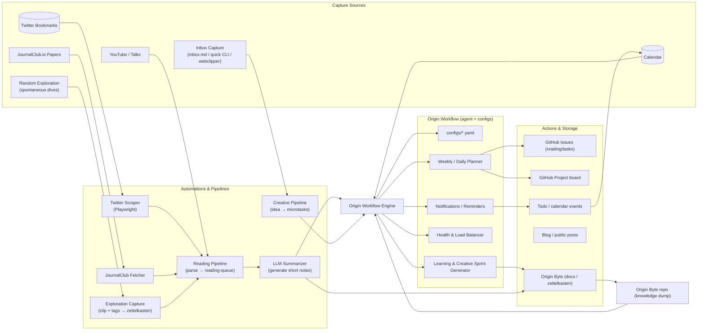

```mermaid
graph LR
    %% Updated Origin Workflow with Random Exploration
    subgraph INPUTS["Capture Sources"]
        Twitter[(Twitter Bookmarks)]
        JC[JournalClub.io Papers]
        YT[YouTube / Talks]
        Inbox["Inbox Capture<br/>(inbox.md / quick CLI / webclipper)"]
        Random["Random Exploration<br/>(spontaneous dives)"]
        Cal[(Calendar)]
    end

    subgraph AUTOMATIONS["Automations & Pipelines"]
        Scraper["Twitter Scraper<br/>(Playwright)"]
        JCFetch[JournalClub Fetcher]
        ReadPipe["Reading Pipeline<br/>(parse → reading-queue)"]
        IdeaPipe["Creative Pipeline<br/>(idea → microtasks)"]
        ExplorePipe["Exploration Capture<br/>(clip + tags → zettelkasten)"]
        Summarizer["LLM Summarizer<br/>(generate short notes)"]
    end

    Twitter --> Scraper --> ReadPipe
    JC --> JCFetch --> ReadPipe
    YT --> ReadPipe
    Inbox --> IdeaPipe
    Random --> ExplorePipe --> ReadPipe
    ReadPipe --> Summarizer --> OW[Origin Workflow Engine]
    IdeaPipe --> OW
    Cal --> OW

    subgraph ENGINE["Origin Workflow (agent + configs)"]
        Configs[configs/*.yaml]
        Planner[Weekly / Daily Planner]
        SprintGen[Learning & Creative Sprint Generator]
        Health["Health & Load Balancer"]
        Notifier[Notifications / Reminders]
    end

    OW --> Configs
    OW --> Planner
    OW --> SprintGen
    OW --> Health
    OW --> Notifier

    subgraph OUTPUTS["Actions & Storage"]
        Issues["GitHub Issues (reading/tasks)"]
        Projects["GitHub Project board"]
        Docus["Origin Byte (docs / zettelkasten)"]
        Blog["Blog / public posts"]
        Tasks["Todo / calendar events"]
    end

    Planner --> Issues
    Planner --> Projects
    SprintGen --> Docus
    Summarizer --> Docus
    Notifier --> Tasks
    Tasks --> Cal

    Docus --> OB["Origin Byte repo (knowledge dump)"]
    OB --> OW
```
