# Database System Diagrams

This document contains Mermaid diagrams that visualize key database concepts and architectures.

## Database Types Classification

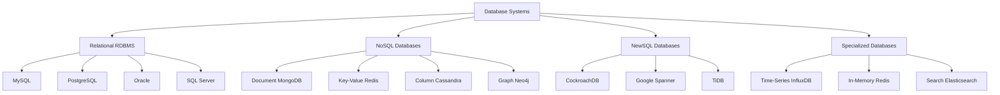

## Database System Architecture

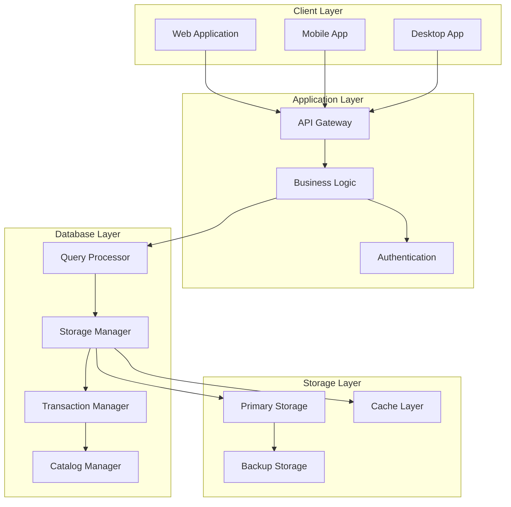

## ACID Properties Visualization

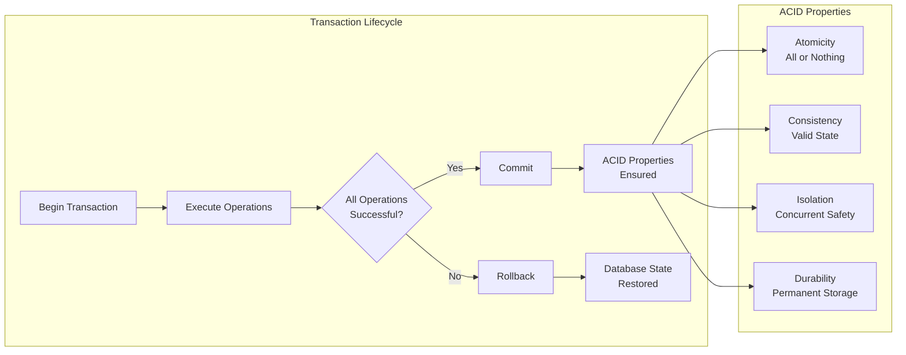

## Database Normalization Process

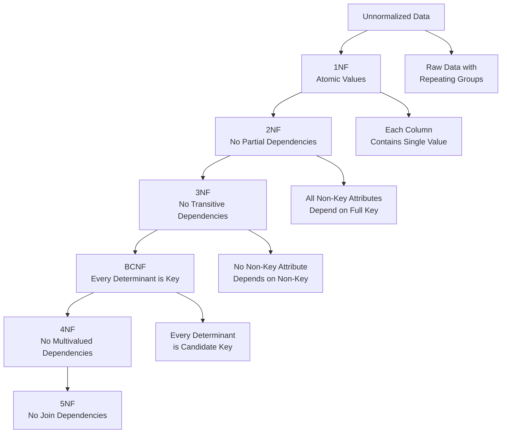

## Database Index Types

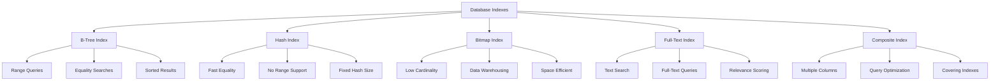

## Database Replication Types

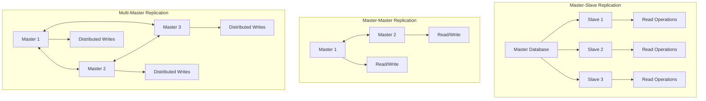

## Database Security Layers

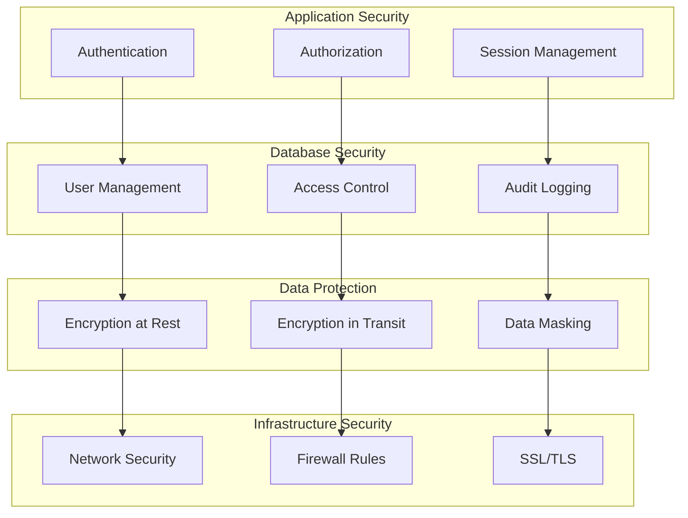

## Database Performance Optimization

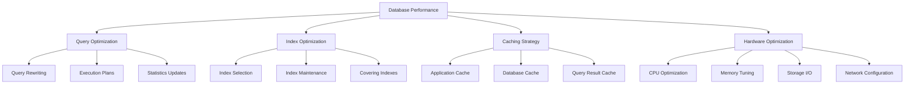

## Modern Database Trends

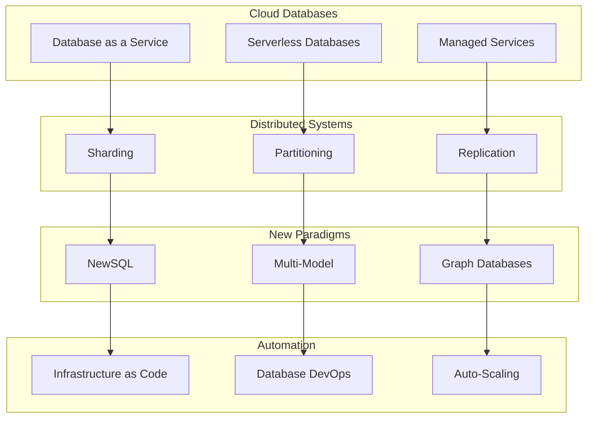

## Database Transaction States

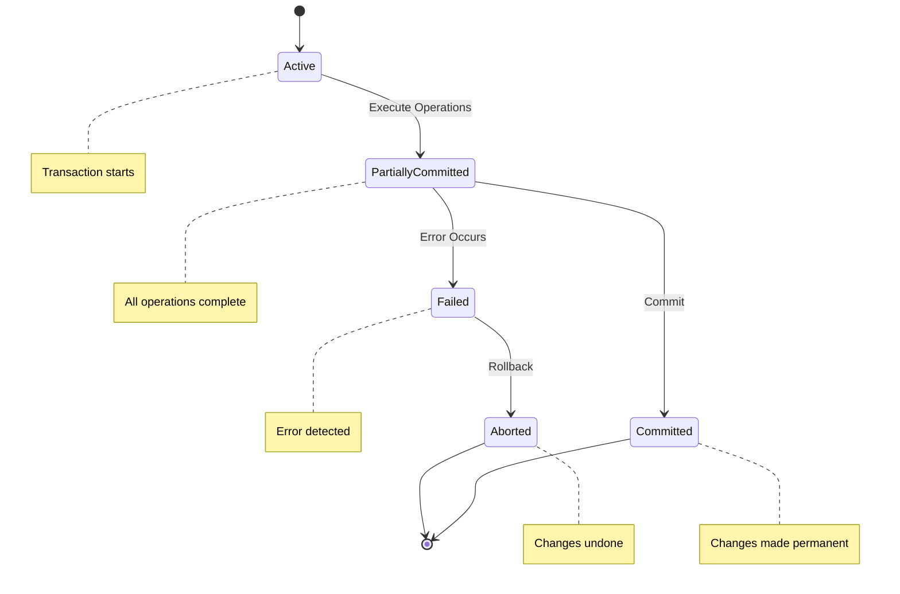

## Database Schema Evolution

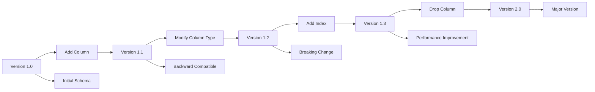

## Database Backup and Recovery

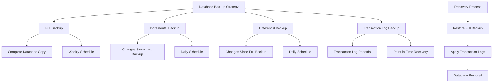

## Database Monitoring and Alerting

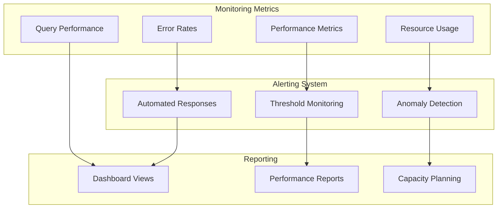

These diagrams provide visual representations of key database concepts, making it easier to understand the relationships and processes involved in database systems.
