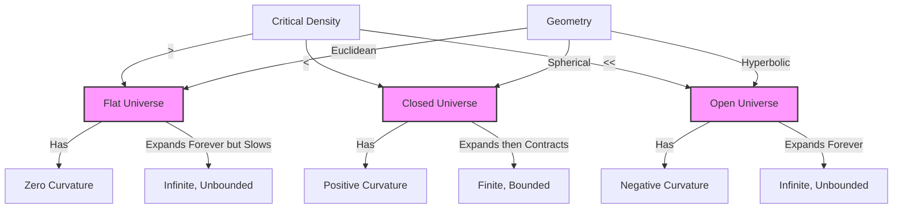

Glossary :

1. Closed Universe
2. Open Universe
3. Flat Universe

# Cosmological Models

## Universe Types and Their Relationships

```mermaid
graph TD
    %% Universe Types
    A[Closed Universe] -->|Has| B[Positive Curvature]
    C[Open Universe] -->|Has| D[Negative Curvature]
    E[Flat Universe] -->|Has| F[Zero Curvature]

    %% Density Relations
    G[Critical Density] -->|>| E
    G -->|<| A
    G -->|<<| C

    %% Expansion Behavior
    A -->|Expands then Contracts| H[Finite, Bounded]
    C -->|Expands Forever| I[Infinite, Unbounded]
    E -->|Expands Forever but Slows| J[Infinite, Unbounded]

    %% Geometric Shapes
    K[Geometry] -->|Spherical| A
    K -->|Hyperbolic| C
    K -->|Euclidean| E

    %% Styling
    classDef universe fill:#f9f,stroke:#333,stroke-width:2px
    class A,C,E universe
```
